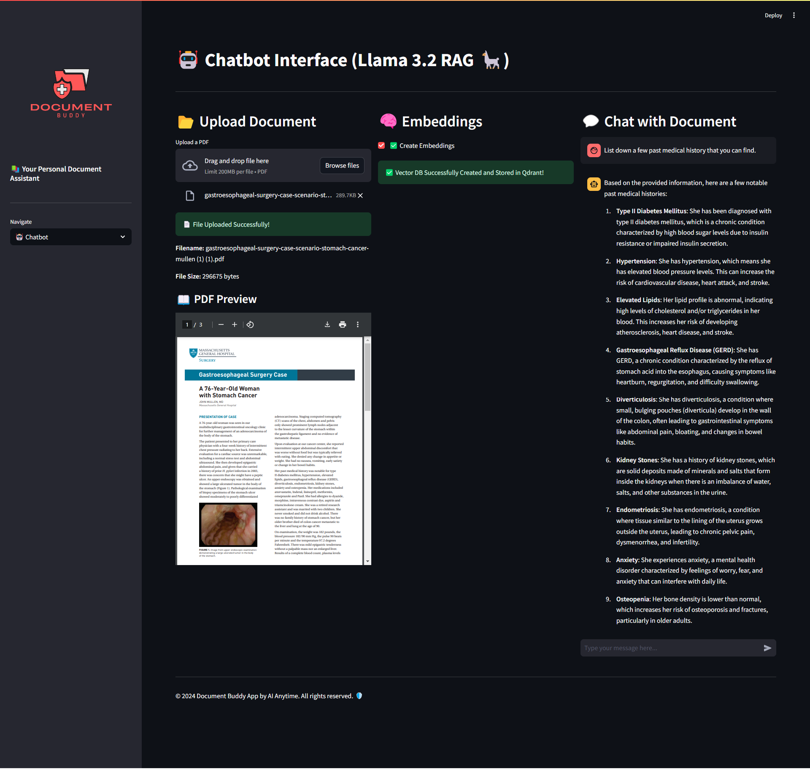

# 📄 Document Buddy App



**Document Buddy App** is a powerful Streamlit-based application designed to simplify document management. Upload your PDF documents, create embeddings for efficient retrieval, and interact with your documents through an intelligent chatbot interface. 🚀

## 🛠️ Features

- **📂 Upload Documents**: Easily upload and preview your PDF documents within the app.
- **🧠 Create Embeddings**: Generate embeddings for your documents to enable efficient search and retrieval.
- **🤖 Chatbot Interface**: Interact with your documents using a smart chatbot that leverages the created embeddings.
- **📧 Contact**: Get in touch with the developer or contribute to the project on GitHub.
- **🌟 User-Friendly Interface**: Enjoy a sleek and intuitive UI with emojis and responsive design for enhanced user experience.

## 🖥️ Tech Stack

The Document Buddy App leverages a combination of cutting-edge technologies to deliver a seamless and efficient user experience. Here's a breakdown of the technologies and tools used:

- **[LangChain](https://langchain.readthedocs.io/)**: Utilized as the orchestration framework to manage the flow between different components, including embeddings creation, vector storage, and chatbot interactions.
  
- **[Unstructured](https://github.com/Unstructured-IO/unstructured)**: Employed for robust PDF processing, enabling the extraction and preprocessing of text from uploaded PDF documents.
  
- **[BGE Embeddings from HuggingFace](https://huggingface.co/BAAI/bge-small-en)**: Used to generate high-quality embeddings for the processed documents, facilitating effective semantic search and retrieval.
  
- **[Qdrant](https://qdrant.tech/)**: A vector database running locally via Docker, responsible for storing and managing the generated embeddings for fast and scalable retrieval.
  
- **[LLaMA 3.2 via Ollama](https://ollama.com/)**: Integrated as the local language model to power the chatbot, providing intelligent and context-aware responses based on the document embeddings.
  
- **[Streamlit](https://streamlit.io/)**: The core framework for building the interactive web application, offering an intuitive interface for users to upload documents, create embeddings, and interact with the chatbot.

## 📁 Directory Structure

document_buddy_app/
```
│── logo.png
├── new.py
├── vectors.py
├── chatbot.py
├── requirements.txt
```

## 🚀 Getting Started

Follow these instructions to set up and run the Document Buddy App on your local machine.

### 1. Clone the Repository

```bash
git clone https://github.com/AIAnytime/Document-Buddy-App.git
cd Document-Buddy-App

2. Create a Virtual Environment

You can either use Python’s venv or Anaconda to create a virtual environment for managing dependencies.

Option 1: Using venv

On Windows:

python -m venv venv
venv\Scripts\activate

On macOS and Linux:

python3 -m venv venv
source venv/bin/activate

Option 2: Using Anaconda

Follow these steps to create a virtual environment using Anaconda:

	1.	Open the Anaconda Prompt.
	2.	Create a new environment:

conda create --name document_buddy python=3.9

(Replace document_buddy with your preferred environment name if desired).

	3.	Activate the newly created environment:

conda activate document_buddy


3. Install Dependencies

Once the environment is set up (whether venv or Conda), install the required dependencies using requirements.txt:

pip install -r requirements.txt

4. Run the App

Start the Streamlit app using the following command:

streamlit run new.py

Note: If your main application file is named differently, replace new.py with your actual file name (e.g., app.py).

This command will launch the app in your default web browser. If it doesn’t open automatically, navigate to the URL provided in the terminal (usually http://localhost:8501).
```

### 🤝 Contributing

Contributions are welcome! Whether it’s reporting a bug, suggesting a feature, or submitting a pull request, your input is highly appreciated. Follow these steps to contribute:

1.	Fork the Repository: Click on the “Fork” button at the top-right corner of the repository page.
2.	Clone Your Fork
3.	Create a New Branch:

```
git checkout -b feature/YourFeatureName
```


4.	Make Your Changes: Implement your feature or fix.
5.	Commit Your Changes:

```
git commit -m "Add Your Feature Description"
```


6.	Push to Your Fork:

```
git push origin feature/YourFeatureName
```


7.	Create a Pull Request: Navigate to the original repository and create a pull request from your fork.

### 📄 License

This project is licensed under the MIT License.

### 📫 Contact

•	Email: aianytime07@gmail.com ✉️

Feel free to reach out for any queries, suggestions, or contributions. Your feedback is invaluable!

© 2024 Document Buddy App by AI Anytime. All rights reserved. 🛡️

### 🔗 Useful Links


•	Streamlit Documentation: https://docs.streamlit.io/

•	LangChain Documentation: https://langchain.readthedocs.io/

•	Qdrant Documentation: https://qdrant.tech/documentation/

•	ChatOllama Documentation: https://github.com/langchain-ai/langchain-llms#ollama

Happy coding! 🚀✨
